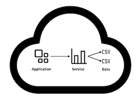
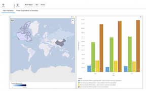

- [Open Data Sets with Kabanero](#open-data-sets-with-kabanero)
  * [Prerequisites](#prerequisites)
  * [The Application](#the-application)
    + [About the data](#about-the-data)
    + [Application structure](#application-structure)
    + [Trusting a remote certificate](#trusting-a-remote-certificate)
    + [Referencing an existing CA database](#referencing-an-existing-ca-database)
    + [Creating a new CA database](#creating-a-new-ca-database)
  * [Setup the service instance](#setup-the-service-instance)
    + [Create a service key](#create-a-service-key)
    + [Bind the service to the cluster](#bind-the-service-to-the-cluster)
  * [Referencing service credentials in an Appsody application](#referencing-service-credentials-in-an-appsody-application)
    + [Mapping a service credential as an environment variable](#mapping-a-service-credential-as-an-environment-variable)
    + [Running the application](#running-the-application)
  * [Remote Deployment](#remote-deployment)
  * [Credits](#credits)


# Open Data Sets with Kabanero

This project is an example of an [Appsody](https://appsody.dev) application connecting to a remote service, showing how the credentials for that service can be used whether the application is running in a coding session with `appsody run` or running in a remote cluster after `appsody deploy`.

The application was developed using the [Kabanero](https://kabanero.io) java-microprofile [collection](https://kabanero.io/docs/ref/general/collection-management.html) and the service is a [Cognos Dashboard Embedded](https://www.ibm.com/us-en/marketplace/cognos-dashboard-embedded) instance, paired with open data sets from the [UNdata](http://data.un.org/) program.   

## Prerequisites

The rest of this tutorial assumes you have gone through the ["Developing cloud native microservices with the Eclipse MicroProfile Collection and Appsody CLI"](https://kabanero.io/guides/collection-microprofile) guide.

Those instructions provide the basic notions of how Appsody can help you create and develop applications. They also ensure you have other software prerequisites installed and working before proceeding. 


## The Application

In a running state, we want a simple arrangement, where the application is interfacing with the service instance using the service credentials. For simplicity, the service instance is configured with pointers to static CSV files. It would have been possible to instruct the service to consume the data from a remote database, but the added complexity was not relevant to the purpose of this example.


|  |
|:--:|
| *Application Components* |


|  |
|:--:|
| *Application Layout* |  

### About the data

UNdata is a repository of open data sets, which are available to the global user community through various downloadable formats and APIs. For this example, the data sets were obtained in CSV format and uploaded to GitHub, since UNdata does not allow downloads from a remote service.

The CSV files were placed in the `/src/main/webapp/csv` directory and are accessed by the service instance using the dashboard specification listed in `/src/main/resources/dashboard-tabbed-spec.json`. Upon inspection of that dashboard specificaton, it is possible to see references to the data URLs, such as `https://raw.githubusercontent.com/nastacio/viz-open-data/master/src/main/webapp/csv/OpenData-UN-RandD.csv`.

The complete documentation for the dashboard service, from authoring a dashboard layout to referencing remote data sources is available [here](https://cloud.ibm.com/docs/services/cognos-dashboard-embedded). 

### Application structure

The application was created using the same steps described in the guide mentioned in the "Prerequisites" section, then augmented with the source required to interface with the service.

### Trusting a remote certificate

The standard java-microprofile collection in Kabanero does not trust any remote certificate. This will change soon, when the underlying Open Liberty runtime adds [this feature](https://github.com/OpenLiberty/open-liberty/issues/9016). 

In the meantime, Open Liberty needs to be instructed to use a trust store for outbound connections. That trust store must contain either the certificate for the signing authority for the service certificate or the service certificate itself, and then referenced in the Open Liberty [SSL Repertoire](https://openliberty.io/docs/ref/config/ssl.html) for outbound connections.

### Referencing an existing CA database

This particular service reference is signed by a well-known signing authority, which is contained the CA database shipped with the Java runtime for Open Liberty.

The Open Liberty configuration [docs](https://openliberty.io/docs/ref/config/#sslDefault.html) explains in detail how to associate that CA database as the truststore for outbound secure communications, resulting in the following modifications to the server.xml file bundled with the application (located under `src/main/liberty/config`):


```
<server description="Liberty server">
    ...

	<keyStore id="defaultTrustStore" 
	    password="changeit"
		readOnly="false" 
		type="JKS" 
		location="${JAVA_HOME}/lib/security/cacerts">
	</keyStore>

	<ssl id="defaultSSLSettings" 
	     keyStoreRef="defaultKeyStore"
		 trustStoreRef="defaultTrustStore"></ssl>

	<sslDefault 
	    sslRef="defaultSSLSettings" 
	    outboundSSLRef="defaultSSLSettings"></sslDefault>

    ...
    
</server>
```

As an exercise to the reader, check the "Hostname verification on SSL configuration" section of this [blog entry](https://openliberty.io/blog/2019/06/21/microprofile-rest-client-19006.html) and make that modification to the `sslDefault` element in the above example.

### Creating a new CA database

The solution in the above section is adopted in this example for the sake of simplicity. In order to achieve stronger trust in outbound communications, a better approach is to create a new keystore containing _solely_ the certificates of the services to be contacted by the application.

This [Stackoverflow thread](https://stackoverflow.com/questions/7885785/using-openssl-to-get-the-certificate-from-a-server) covers a number of techniques for obtaining a copy of the certificate used to secure traffic to a remote server. For the purposes of this section, the service certificate is already downloaded and available at `/src/main/resources/us-southdynamic-dashboard-embeddedcloudibmcom.crt`.

The next sections require the `keytool` utility for managing key stores. You could install Open JDK 9 in order to have the utility in your local computer, but a more convenient mechanism is to simply launch the application with `appsody run`, then use `docker exec...` to have access to the JDK already bundled with the container running the application.

Launch the application with `appsody run` and open a shell into it using a new terminal session:

```
docker exec -it viz-open-data-dev /bin/sh

keytool -importkeystore -srckeystore /opt/java/openjdk/jre/lib/security/cacerts -srcstorepass changeit -keystore /project/user-app/src/main/liberty/config/resources/security/truststore.p12 -storetype PKCS12 -deststorepass mpKeystore 
```

Still in the shell inside the container, add the new key to the new trust store. Note that the key location may be different in your system, so the path in the instruction below may need to be adjusted to match the location of other service certificates in the future:

```
keytool -importcert -file /project/user-app/src/main/resources/us-southdynamic-dashboard-embeddedcloudibmcom.crt -alias ussouthcde -keystore  /project/user-app/src/main/liberty/config/resources/security/truststore.p12 -noprompt -storetype PKCS12 -storepass mpKeystore
```

Now we replace the path of the `/opt/java/openjdk/jre/lib/security/cacerts` in server.xml with `truststore.p12`, as follows:

```
<server description="Liberty server">
    ...

	<keyStore id="defaultTrustStore" 
	    password="changeit"
		readOnly="false" 
		type="JKS" 
		location="truststore.p12">
	</keyStore>

	<ssl id="defaultSSLSettings" 
	     keyStoreRef="defaultKeyStore"
		 trustStoreRef="defaultTrustStore"></ssl>

	<sslDefault 
	    sslRef="defaultSSLSettings" 
	    outboundSSLRef="defaultSSLSettings"></sslDefault>

    ...
    
</server>
```

Note that this new location is not an absolute path anymore, since it does not reside in the container image running the application. The lack of an absolute path means Open Liberty will look for it in the default runtime location (`/project/target/liberty/wlp/usr/servers/defaultServer/resources/security`) , so we need to tell Appsody to place the new trust store in that location, by making a modification to the `pom.xml` file at the root directory of the application.

The modification is based on the usage of the [Maven Resources Plugin](https://maven.apache.org/plugins/maven-resources-plugin/) to copy the new trust store from its location in the code repository to the location expected by Open Liberty. In short, we need to add a new  `plugin` reference under the `build/plugins` element of the `pom.xml` file:

```
			<plugin>
				<artifactId>maven-resources-plugin</artifactId>
				<version>2.6</version>
				<executions>
					<execution>
						<id>copy-resources</id>
						<phase>install</phase>
						<goals>
							<goal>copy-resources</goal>
						</goals>
						<configuration>
							<outputDirectory>${basedir}/target/liberty/wlp/usr/servers/defaultServer/resources/security</outputDirectory>
							<resources>
								<resource>
									<directory>${basedir}/src/main/liberty/config/resources/security</directory>
									<filtering>false</filtering>
									<includes>
										<include>truststore.p12</include>
									</includes>
								</resource>
							</resources>
						</configuration>
					</execution>
				</executions>
			</plugin>
```

With these changes in place, the new `truststore.p12` file will be placed in the running container and referenced from the Open Liberty server configuration, allowing the application to connect to the remote service. 


 
## Setup the service instance

Cognos Dashboard Embedded is exclusive to the IBM Cloud, so you need to [create an IBM Cloud account](https://cloud.ibm.com/registration).

- [Install the IBM Cloud CLI](https://cloud.ibm.com/docs/cli)

- [Create an IBM Cloud API Key](https://cloud.ibm.com/iam/apikeys). Copy the "API key" value and paste it somewhere safe. It will be used later to login via command-line interface and referenced as `${IBMCLOUD_API_KEY}` in the instructions. 

With the IBM Cloud CLI and the API Key setup, it is time to create a "Lite" plan instance of Cognos Dashboard Embedded (that is a free service that gets deleted after 30 days of inactivity) .

Type the following commands in a terminal:


```
ibmcloud login --apikey ${IBMCLOUD_API_KEY}
 
ibmcloud resource service-instance-create open-data-cognos-de dynamic-dashboard-embedded lite us-south -g default
```

### Create a service key

The service instance can have multiple credentials with different roles. For this sample, we want a key with the "Reader" role:

```
ibmcloud resource service-key-create cognos-dashboard-key Reader --instance-name open-data-cognos-de 

ibmcloud resource service-key cognos-dashboard-key -g default --output json
```

The structure of a service credential is specific to the service and therefore needs specific code inside the application code to be parsed. For this particular service, the structure looks like this:

```
{
  "api_endpoint_url": "https://us-south.dynamic-dashboard-embedded.cloud.ibm.com/daas/",
  "apikey": "...",
  "client_id": "...",
  "client_secret": "...",
  "iam_apikey_description": "Auto-generated for key 5c3845e2-e198-4843-8ce7-811d2c054b3b",
  "iam_apikey_name": "cognos-dashboard-key",
  "iam_role_crn": "...",
  "iam_serviceid_crn": "crn:v1:bluemix:public:iam-identity::..."
}
```

### Bind the service to the cluster

This step makes the service credentials available to the cluster:

```
cluster_name=<put your cluster name here>
ibmcloud ks cluster service bind --cluster ${cluster_name} --service open-data-cognos-de -n default
```

Internally, this command simply creates a Kubernetes `Secret` object, prepending the word "binding-" to the service instance name in order to generate the secret name.

We can inspect the contents of the Secret, first changing the configuration context of the `kubectl` CLI using the following command: 

```
cluster_name=<put your cluster name here>
eval $(ibmcloud ks cluster config --cluster ${cluster_name} --export)
```

Note that users of Docker Desktop can change the configuration context of `kubectl` by  right-clicking the Docker icon and choosing "Kubernetes", then "_<clustername>_".

With `kubectl` pointing to the remote cluster, use the secret name to inspect its contents:

```
kubectl get secret binding-open-data-cognos-de -o json

{
    "apiVersion": "v1",
    "data": {
        "binding": "<base64 encoding of the service credentials"
    },
    "kind": "Secret",
    "metadata": {
        "name": "binding-open-data-cognos-de",
        "namespace": "default",
        ...
    },
    "type": "Opaque"
}
```
  
## Referencing service credentials in an Appsody application

We want the local development environment to mimic the environment when the application is running inside a Kubernetes cluster, so that the application developer does not have to write different code for the different environments.

Service credentials are created as a [secret](https://kubernetes.io/docs/concepts/configuration/secret/) inside a Kubernetes cluster. A Kubernetes secret can be exposed to an application in [many different ways](https://kubernetes.io/docs/concepts/configuration/secret/#using-secrets), and the [Appsody Application Operator](https://github.com/appsody/appsody-operator) can create deployment configurations using those same strategies.

For this example, we are using the approach of environment variables, since they can be equally injected into the containers created by Appsody when running the application in a local development environment. [This Appsody issue](https://github.com/appsody/appsody/issues/509) will eventually make possible to use volume mounts during development as well.

Important: Common characters such as "-" and "." are not valid in environment variable names. Make sure to check the [specification](https://pubs.opengroup.org/onlinepubs/000095399/basedefs/xbd_chap08.html) for Unix environment variables when choosing names.

### Mapping a service credential as an environment variable

Appsody applications are created in a cluster as an `AppsodyApplication` application,
which are handled by the Appsody Application Operator.   

We want the Appsody Application Operator to pull out the `binding` key from the `binding-open-data-cognos-de` secret created by the `ibmcloud ks cluster service bind` invocation, then make it available as an environment variable named `cognos_binding` for the application, which can be achieved with the following snippet in the app-deploy.yml file created by Appsody in the root directory of the application:

```
  env:
    - name: cognos_binding
      valueFrom:
        secretKeyRef:
          name: binding-open-data-cognos-de
          key: binding
```

This snippet will name the environment variable `cognos_binding` and set it to the *decoded* value of the `binding` key in the `binding-open-data-cognos-de` secret.

Refer to the [Appsody Application Operator User Guide](https://github.com/appsody/appsody-operator/blob/master/doc/user-guide.md) for further details on configuration options.


### Running the application

The application will need an environment variable containing the service credentials available in the cluster under the `binding-open-data-cognos-de` secret, so the first step is to create a properties file containing those credentials.

Once again, from a terminal, create the credentials and store them in a properties file that can be referenced later when running the application locally:

Note that MacOS has a slightly backward version of the `base64` utility, so the parameter for `base64` is `-D` instead of `-d`:

MacOS:

```
cognos_credentials="$(kubectl get secret binding-open-data-cognos-de -o jsonpath='{.data.binding}' | base64 -D)"
```

Linux:

```
cognos_credentials="$(kubectl get secret binding-open-data-cognos-de -o jsonpath='{.data.binding}' | base64 -d)"
```

Then finally:

```
cat > ~/tmp/sample_cognos_binding.txt << EOF
cognos_binding=${cognos_credentials}
EOF

```

Once could also use the `ibmcloud resource` CLI to get the credentials, though that would also require the presence of the [jq](https://stedolan.github.io/jq/) utility in the local development environment:

```
cognos_credentials="$(echo $(ibmcloud resource service-key cognos-dashboard-key -g default --output json | jq .[].credentials))"

cat > ~/tmp/sample_cognos_binding.txt << EOF
cognos_binding=${cognos_credentials}
EOF
```

With the environment variable in a file, we can instruct `appsody run` to pass that file to container running the application, as follows:

```
appsody run --docker-options="--env-file=$(echo ~)/tmp/sample_cognos_binding.txt"
```

The `--env-file` option instructs docker to export each `env_var_name=value` entry in the file as an environment variable, which makes it possible to include multiple secrets using that same file.


## Remote Deployment


With the application configured to connect to the remote service, it is possible to use `appsody deploy` to deploy the application to a cluster.

The command will use `kubectl` to interface with the cluster, so we need to configure `kubectl` to point to the cluster:

```
cluster_name=<put your cluster  name here>
eval $(ibmcloud ks cluster config --cluster ${cluster_name} -s)
```
 
Since the cluster is remote to your local docker daemon, the `deploy` command must also specify the `--push` parameter, so that the image is pushed to a remote repository accessible by the cluster.

```
docker_namespace=<insert your docker image namespace here>
appsody deploy --push --tag ${docker_namespace}/viz-open-data:0.0.1
```

Once the application deployment is complete, `appsody` will display the address for the newly deployed application.

In the case of a free-tier cluster in the IBM cloud, due to [issue #764](https://github.com/appsody/appsody/issues/764), the address may not be displayed, so you need to get the public IP address from the cluster workers:


```
cluster_name=<put your cluster  name here>

node_name=$(kubectl get pod -l app.kubernetes.io/name=jee-sample -o jsonpath='{.items[].spec.nodeName}')

public_ip=$(kubectl get node ${node_name} -o jsonpath='{.status.addresses[?(@.type=="ExternalIP")].address}')

public_port=$(kubectl get service jee-sample -o jsonpath='{.spec.ports[0].nodePort}')

echo "http://${public_ip}:${public_port}"

```


## Credits

- The project was inspired by the session ["Open Data: The New Oil Fueling Civic Tech"](https://allthingsopen.org/talk/open-data-the-new-oil-fueling-civic-tech/), presented by [Jason Hibbets](https://twitter.com/jhibbets) at the [ATO2019 conference](https://allthingsopen.org).
- Table of contents generated with [markdown-toc](http://ecotrust-canada.github.io/markdown-toc/)
